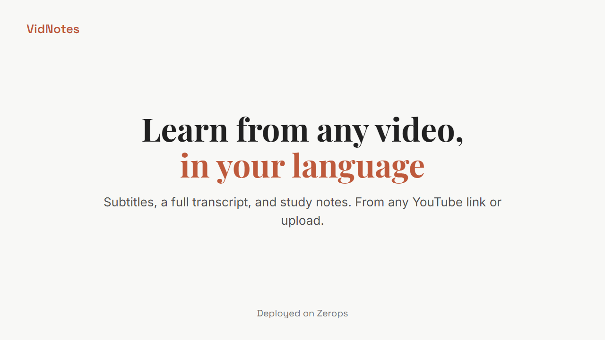

<h1 align="center">VidNotes</h1>
<p align="center"><b>Turn any lecture video into subtitles, a clean transcript, and study notes, in dozens of languages.</b></p>
<p align="center">
  <a href="https://app-2c58-8000.prg1.zerops.app"><b>Live app</b></a> &nbsp;|&nbsp; deployed on <b>Zerops</b>
</p>

## Demo

https://raw.githubusercontent.com/Bsh54/vidnotes-zerops/main/docs/demo.mp4

<p align="center">
  <a href="https://raw.githubusercontent.com/Bsh54/vidnotes-zerops/main/docs/demo.mp4">
    
  </a>
</p>

---

## The problem

Hundreds of millions of students learn in a language that is not their own. They watch lectures on YouTube or record their classes, but they lose half of the content because it is delivered in English or French while they think in Wolof, Arabic, Spanish, or Hindi. Taking notes while fighting the language is nearly impossible, and rewatching a 45 minute lecture three times does not scale.

## What it does

Upload a video (or paste a YouTube link), pick the language you actually think in, and in about two minutes you get back three things:

1. **Subtitled video** with clean, readable subtitles burned into the picture, translated into your language.
2. **Full transcript**, timestamped and searchable.
3. **Study notes (PDF)**, a detailed, sectioned summary with key concepts, takeaways, and a self quiz, entirely in your chosen language.

Dozens of languages are supported, including many African languages (Wolof, Yoruba, Swahili, Fon) that almost no other tool covers.

## Deployed on Zerops

The whole app runs on [Zerops](https://zerops.io). A single `zerops.yaml` describes the build and the runtime:

- **Runtime:** Python 3.12 on Alpine, served by gunicorn behind the Zerops L7 balancer, reachable on a live Zerops subdomain.
- **System packages** (ffmpeg, chromium) are installed at runtime through `run.prepareCommands`.
- **Secrets** (Groq and Gemini keys) are stored as Zerops environment secrets, never in the repository.
- **Deploy pipeline:** built and shipped through the Zerops CLI / Control Plane, so a push goes from code to a running, verified URL.

```yaml
zerops:
  - setup: app
    build:
      base: python@3.12
      os: alpine
      buildCommands:
        - python3 -m pip install -r requirements.txt
    run:
      base: python@3.12
      os: alpine
      prepareCommands:
        - sudo apk add --no-cache ffmpeg chromium nss freetype harfbuzz ttf-freefont
      ports:
        - port: 8000
          httpSupport: true
      start: gunicorn --bind 0.0.0.0:8000 --workers 1 --threads 8 --timeout 1800 app:app
```

## How it works

```
upload / YouTube link
        |
        v
 audio extract (ffmpeg, mono 16k)
        |
        v
 transcribe (Groq Whisper large-v3-turbo)  ->  segments + timestamps
        |
        |-- translate (Gemini) --> subtitles (ASS) --> burn into video (ffmpeg)
        |-- clean transcript
        '-- study notes (Gemini) --> localized PDF (chromium headless)
```

## Tech stack

`Python` , `Flask` + `gunicorn` , `Groq (Whisper)` , `Google Gemini` , `FFmpeg` , `Chromium (headless PDF)` , `yt-dlp` , `SQLite (analytics)` , deployed on `Zerops`.

## Run it locally

```bash
git clone https://github.com/Bsh54/vidnotes-zerops.git
cd vidnotes-zerops
pip install -r requirements.txt
cp .env.example .env        # then add your GROQ_API_KEY (and GEMINI_API_KEY)
gunicorn -w 1 --threads 8 -b 127.0.0.1:8000 --timeout 1800 app:app
# open http://127.0.0.1:8000
```

You need a free [Groq API key](https://console.groq.com/keys) and a free [Gemini API key](https://aistudio.google.com/apikey).

## Project structure

| File | Role |
|---|---|
| `app.py` | Flask app: routes, job queue, PDF export, rate limits |
| `worker.py` | The engine: transcription, translation, subtitle burn, study notes |
| `guard.py` | Anti abuse: per IP rate limits, concurrency caps, disk safety net |
| `analytics.py` | Lightweight usage analytics (SQLite) |
| `static/` | Front end (home / language picker / processing / result) |
| `zerops.yaml` | Zerops build and runtime definition |

## Anti abuse and safety

Per IP sliding window rate limits, concurrent job caps, input duration and size limits, and an automatic disk safety net, all configurable through environment variables (see `.env.example`).

## License

MIT, see [LICENSE](LICENSE).
